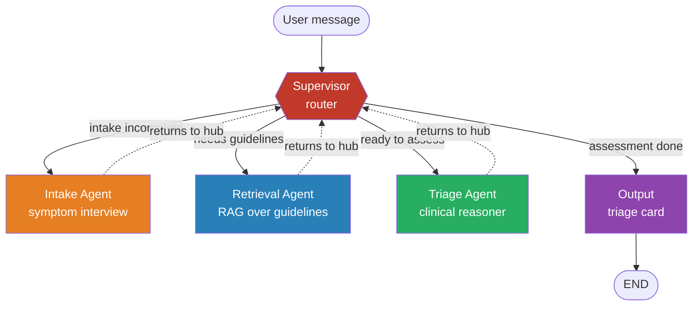

# TriageAI — Multi-Agent Clinical Triage System

A multi-agent pediatric triage assistant built on **LangGraph**. It interviews a caregiver about a child's symptoms, retrieves relevant clinical guidelines, reasons over them, and produces a structured triage recommendation — all coordinated by a supervisor agent over a shared, type-safe state.

> **Disclaimer:** an educational project, not a medical device. Triage logic is grounded in published IMNCI guidance but must not be used for real clinical decisions.

---

## What it does

Given a free-text complaint (e.g. *"3-year-old has had a cough for 4 days and is breathing fast"*), the system:
1. **Interviews** the caregiver, asking one focused follow-up question at a time until it has enough information.
2. **Retrieves** matching clinical guidelines from a vector store (RAG).
3. **Reasons** over symptoms + guidelines to classify severity.
4. **Outputs** a structured triage card with one of four levels mapped to **IMNCI** classifications: **Emergency** (immediate referral), **Urgent** (same-day), **Standard** (48–72h), or **Self-care** (home management).

---

<!-- ============================================================= -->
<!-- Paste these two sections into your README where indicated.    -->
<!-- GitHub renders the Mermaid diagram natively — no image file.  -->
<!-- ============================================================= -->

## Architecture

A **hub-and-spoke multi-agent graph** built on LangGraph. The supervisor is the hub; every agent reports back to it, and the supervisor alone decides who runs next. Agents never call each other directly — which keeps routing in one place and each agent independently testable.



**Human-in-the-loop:** `interrupt_before=["intake"]` pauses the graph before each interview turn, so the UI can surface the question and wait for the caregiver's reply — a real multi-turn conversation, not a one-shot prompt.

**Stateful persistence:** a checkpointer keyed by `thread_id` restores exact graph state between turns, so a session resumes from where it left off. `MemorySaver` in dev; swap to `SqliteSaver`/`PostgresSaver` for production with no other code changes.

---

## Example session

> *Illustrative run showing the multi-turn flow; the triage logic is grounded in IMNCI guidance retrieved via RAG.*

```
👤 User:      My 3-year-old has had a cough for 4 days and seems to be
              breathing fast.

🤖 Intake:    How many breaths per minute is the child taking, and for how
              long has the fast breathing been going on?

👤 User:      About 50 per minute, started 2 days ago.

🤖 Intake:    Any fever, and is the child still drinking and feeding normally?

👤 User:      Mild fever since yesterday. Still drinking but eating less.

🤖 Intake:    Is there any chest indrawing, bluish lips, or unusual drowsiness?

👤 User:      No blue lips or drowsiness, but the chest does seem to pull in.

🔍 Retrieval: [searching clinical guidelines: "fast breathing + chest
              indrawing, age 3" → IMNCI pneumonia criteria]

🧠 Triage:    Reasoning over symptoms + retrieved guidance…

┌─────────────────────────────────────────────────────────────┐
│  TRIAGE RESULT                                    ⚠  URGENT   │
├─────────────────────────────────────────────────────────────┤
│  Suspected: Pneumonia (fast breathing + chest indrawing)      │
│  Level:     URGENT — seek same-day medical care               │
│  Basis:     Respiratory rate ≥40/min with lower chest         │
│             indrawing in a child aged 1–5 (IMNCI)             │
│  Advise:    Do not wait; visit a clinic or health worker      │
│             today. Watch for blue lips or drowsiness →        │
│             emergency referral.                               │
└─────────────────────────────────────────────────────────────┘
```

---

## Engineering highlights

- **Human-in-the-loop:** `interrupt_before=["intake"]` pauses the graph before each interview turn so the UI can surface the question and wait for the caregiver's reply — a real conversational loop, not a one-shot prompt.
- **Stateful persistence:** a LangGraph checkpointer keyed by `thread_id` restores exact graph state between turns/HTTP requests, so multi-turn sessions resume seamlessly. (`MemorySaver` in dev; swap to `SqliteSaver`/`PostgresSaver` for production with zero other changes.)
- **Type-safe shared state:** Pydantic models (`Symptom`, `VitalSigns`, `PatientSummary`, `SuspectedCondition`, `TriageResult`) are the single source of truth; LLMs emit them directly via `.with_structured_output()`, so malformed fields are caught at the boundary.
- **RAG grounding:** clinical guidelines are ingested, embedded, and retrieved via a vector-search tool, so triage decisions cite source guidance rather than relying on the model's parametric memory.
- **Tested:** a pytest suite covers state, the graph wiring, individual agents, and the RAG layer.

---

## Repo structure

```
agents/      supervisor (router) · intake · retrieval · triage
rag/         embeddings · ingest · store        (vector store + RAG)
tools/       vector_search
prompts/     per-agent prompt templates
state.py     Pydantic data models + LangGraph TypedDict state + enums
graph.py     StateGraph wiring, interrupts, checkpointing, run_turn()
output.py    triage-card formatting
app.py       Gradio frontend
tests/       test_state · test_graph · test_agents · test_rag
```

## Run

```bash
pip install -r requirements.txt
# set your LLM API key in the environment
python app.py        # launches the Gradio interface
pytest               # run the test suite
```

## Tech

LangGraph · LangChain · Pydantic · a vector store for RAG · Gradio · pytest.
